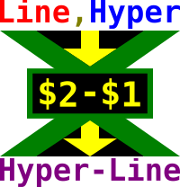

# Line Hyper-eXpander



The LHX is dual:

- it is a tool to do some work
- it is a sandbox to learn how to program in the Haskell language

## Idea

The central idea is to make possible to transform some text line-by-line using a simple templating language: rename a group of files, generate HTML lists and tables, etc. More info you can find in the project's wiki.

## Example

```
$ ls -l /tmp/files
total 0
-rw-r--r-- 1 user 0 2022-10-04 09:02 one
-rw-r--r-- 1 user 0 2022-10-04 09:02 three
-rw-r--r-- 1 user 0 2022-10-04 09:02 two
$ ls -l /tmp/files | lhx --skip-errors -e 'mv $7 $5_$7'
mv one 2022-10-04_one
mv three 2022-10-04_three
mv two 2022-10-04_two
```
